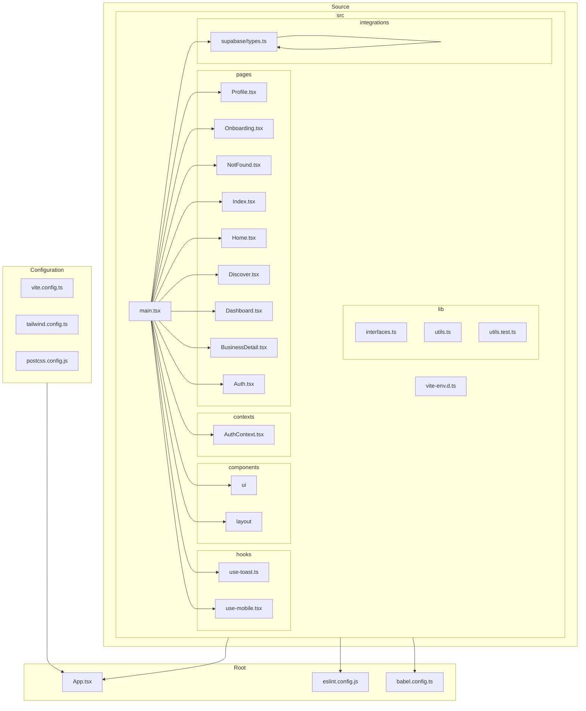

    

    <b>Automatic Architecture Diagrams from Code</b> 
    <a href="https://github.com/swark-io/swark">GitHub</a> • <a href="https://swark.io">Website</a> • <a href="mailto:contact@swark.io">Contact Us</a>

## Usage Instructions

1. **Render the Diagram**: Use the links below to open it in Mermaid Live Editor, or install the [Mermaid Support](https://marketplace.visualstudio.com/items?itemName=bierner.markdown-mermaid) extension.
2. **Recommended Model**: If available for you, use `claude-3.5-sonnet` [language model](vscode://settings/swark.languageModel). It can process more files and generates better diagrams.
3. **Iterate for Best Results**: Language models are non-deterministic. Generate the diagram multiple times and choose the best result.

## Generated Content
**Model**: GPT-4o - [Change Model](vscode://settings/swark.languageModel)  
**Mermaid Live Editor**: [View](https://mermaid.live/view#pako:eNqFVMty4jAQ_BWVzoG9c9gqgpMNeQABEpLIe5DtwdaurXHpwUKl8u8x9hoZOVW59XRresYajd9pjAnQEQ1lqniZkXUQSkK0jZpwgnIrUqu4ESiPCiFjthMGhnGtDI3-3dCXzHCR_xMy6UkTVqI2sdat8qdRQCahPCu3QqtiaLJOpFZxwxAS1LUHIHfDxPkTcsUKLmTF7E_UKT0XUcsRcs2ENKC2PAbdNSDkF7NG5B5505KgTVepO_fqlDwF7VKnbKFwK3I464qQWzaXEXKVCJl60h2boblGKxNPuGdTmcDeYx_YDRa-_YwFQse4A-UJcxZwndWVPWXBLq0WErQO4DhDT35kY2uyM_Krz4-xKFGCNJ07WDIrOk4rlvMDWvONTzWgfddlXTcwafhv-8gQ_3aSn5jVMDDIzwdIyHMtFBj5I_rK9Pho0mYJOt4bpm3JI66hn_wf9J_4EtE0R17YuCw7pV8Z6Lyq5G0JIW8s4hHk3l6drM92lAwGP8lLXVHF_eC1G7wdg6saTh28dfDOwXsHHxycOTh3cOHgo4NrB5cOrhx8cvDZwc0Rbhp4uu8fcS6qp9ZeRU82h7Ldb3pBC1DV7yGp_nLvITUZFBDSEQlpAltucxPSj-qQLRNuIBC8GlNBR0ZZuKDcGlwdZNzGCm2a0dGW5xo-PgFnm5jX) | [Edit](https://mermaid.live/edit#pako:eNqFVMty4jAQ_BWVzoG9c9gqgpMNeQABEpLIe5DtwdaurXHpwUKl8u8x9hoZOVW59XRresYajd9pjAnQEQ1lqniZkXUQSkK0jZpwgnIrUqu4ESiPCiFjthMGhnGtDI3-3dCXzHCR_xMy6UkTVqI2sdat8qdRQCahPCu3QqtiaLJOpFZxwxAS1LUHIHfDxPkTcsUKLmTF7E_UKT0XUcsRcs2ENKC2PAbdNSDkF7NG5B5505KgTVepO_fqlDwF7VKnbKFwK3I464qQWzaXEXKVCJl60h2boblGKxNPuGdTmcDeYx_YDRa-_YwFQse4A-UJcxZwndWVPWXBLq0WErQO4DhDT35kY2uyM_Krz4-xKFGCNJ07WDIrOk4rlvMDWvONTzWgfddlXTcwafhv-8gQ_3aSn5jVMDDIzwdIyHMtFBj5I_rK9Pho0mYJOt4bpm3JI66hn_wf9J_4EtE0R17YuCw7pV8Z6Lyq5G0JIW8s4hHk3l6drM92lAwGP8lLXVHF_eC1G7wdg6saTh28dfDOwXsHHxycOTh3cOHgo4NrB5cOrhx8cvDZwc0Rbhp4uu8fcS6qp9ZeRU82h7Ldb3pBC1DV7yGp_nLvITUZFBDSEQlpAltucxPSj-qQLRNuIBC8GlNBR0ZZuKDcGlwdZNzGCm2a0dGW5xo-PgFnm5jX)

